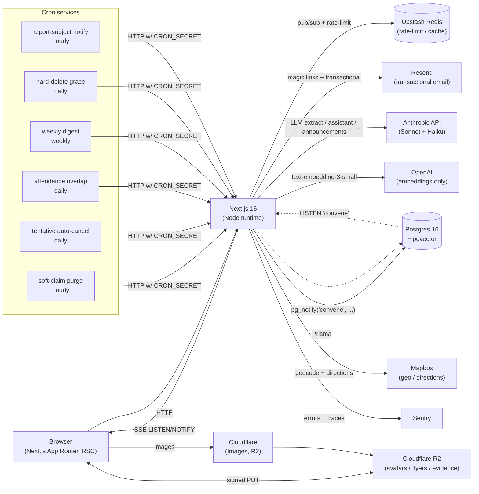

# Convene

A calendar for overlapping community groups in a single local scene. See `convene-prd.md` for the full product spec, `STATUS.md` for an honest "what runs vs. what's a stub" inventory, and `docs/decisions.md` for the load-bearing architecture decisions.

License: AGPL-3.0. Code is public from day 1.

## Architecture at a glance



## What's interesting in this codebase

- **Postgres LISTEN/NOTIFY + SSE** for sub-second realtime without WebSockets or a hosted realtime service (`lib/realtime.ts`, `app/api/realtime/stream/route.ts`).
- **Row-level locks** wrapping RSVP capacity, soft-claim ≤2 cap, group admin invariants (`lib/tx.ts`).
- **One visibility function** for blocks + scopes + vouches + invites + friendship (`lib/visibility.ts`). Every read path runs through it.
- **Sliding-window rate limit** with account-age scaling, backed by Redis when available, Postgres fallback (`lib/rate-limit.ts`).
- **LLM budget guard** — per-user daily cap in the rate-limit table; prompt caching enabled on the long system prompts (`lib/anthropic.ts`).
- **pgvector semantic search** on event descriptions, embedded via OpenAI `text-embedding-3-small` at $0.02/1M tokens (`lib/embeddings.ts`).
- **Web Push** with a service worker, optional and falls back gracefully when VAPID keys aren't configured (`lib/web-push.ts`, `public/sw.js`).
- **CI** runs typecheck → migrate → seed → build → Playwright e2e against a Postgres service container.

## Stack

- Next.js 16 (App Router, Turbopack)
- Postgres via Prisma 6 (Neon for managed hosting)
- Auth.js v5 — email magic link (Resend)
- Anthropic Claude — paste-to-event, OCR, announcements, assistant
- Mapbox GL JS + Mapbox geocoding/directions
- Cloudflare R2 — file storage (S3 SDK)
- shadcn/ui primitives + Tailwind v4

## Getting started

```bash
cp .env.example .env.local
# fill in DATABASE_URL, AUTH_SECRET, RESEND_API_KEY, ANTHROPIC_API_KEY,
# MAPBOX_TOKEN, NEXT_PUBLIC_MAPBOX_TOKEN, R2_*, CRON_SECRET

npm install
npx prisma migrate dev
npm run prisma:seed       # seeds the convention calendar (§6.7)
npm run dev
```

## Project layout

The codebase is organized so each concern has **one** authoritative module. New
features should extend the existing canonical helpers rather than spawning
parallel implementations.

```
app/
  layout.tsx              shell — TopBar + MobileTabBar
  page.tsx                For-You feed
  login/, verify/, onboarding/
  calendar/               month/week/agenda views (§6.5)
  map/                    Mapbox view (§12.1)
  groups/, g/[slug]/      directory, detail, admin
  e/[id]/                 event detail / edit / admin
  e/new/                  + from-text (§10.1) + from-image (§10.2)
  u/[id]/, me/            profiles
  settings/               profile, privacy, notifications, blocks,
                          calendar-feeds, export, delete
  reports/                incident reporting + audit (§8.7)
  notifications/          in-app feed
  _actions/               server actions (one file per entity)
  api/
    auth/[...nextauth]    Auth.js handler
    ical/...              user/group/public feeds (§6.6)
    llm/...               Anthropic-backed endpoints
    mapbox/...            geocode + directions proxy
    upload/sign           R2 signed upload URLs
    me/export             user data export (§8.9)
    cron/...              soft-claim expiry, tentative sweep,
                          attendance overlap, weekly digest,
                          hard-delete grace expiry

lib/
  db.ts                   Prisma client singleton
  auth.ts                 Auth.js config (magic link)
  auth-helpers.ts         requireUser / requireAdmin / requireMember
  visibility.ts           SINGLE source of "can U see X" — blocks,
                          friendship, scope, vouches, invites
  conflict-detection.ts   §6.4 — hard/soft/adjacent + alternatives
  recurrence.ts           rrule expand()
  notifications.ts        single fan-out for in-app + email
  anthropic.ts            client + per-user rate limit (§10.4)
  llm/                    extract-event, announcements, assistant
  mapbox.ts               geocode + cached directions (§12.2)
  r2.ts                   signed upload URLs with per-kind limits
  ical.ts                 user / group / public feed generators
  recommendations.ts      §11.2 heuristic
  waitlist.ts             goingCount, statusForNewGoing, promote
  conditional-rsvps.ts    §9.2 evaluator
  attendance-overlap.ts   §9.4 nightly compute
  schemas.ts              zod schemas shared by forms and actions
  email/                  resend templates

components/
  ui/                     shadcn primitives
  layout/                 top bar, mobile tab bar
  calendar/               MonthView / WeekView / AgendaView / FilterChips
  events/                 EventForm, RSVPButton, ConflictWarning,
                          PasteToEvent, ImageToEvent, AnnouncementGenerator,
                          SoftClaimForm
  groups/                 GroupCard, GroupForm, JoinButton
  profile/                ProfileActions, VouchButton
  map/                    MapView (mapbox-gl)
  safety/                 ReportForm
  settings/               ProfileForm, PrivacyForm, NotificationPrefs

prisma/
  schema.prisma           data model — exactly §5 of the PRD
  seed.ts                 convention calendar (Anthrocon, MFF, FWA, …)
```

## DRY rules — extend, don't duplicate

- **Auth checks** → `lib/auth-helpers.ts` (`requireUser`, `requireAdmin`, `requireMember`).
- **Who can see what** → `lib/visibility.ts` (`canSeeEvent`, `canSeeWithVisibility`, `filterVisibleEvents`, `blockedUserIds`).
- **Conflict detection** → `lib/conflict-detection.ts` (`detectConflicts`).
- **Recurrence** → `lib/recurrence.ts` (`expand`, `expandAll`).
- **Sending anything to a user** → `lib/notifications.ts` (`dispatch`, `dispatchMany`).
- **LLM calls** → `lib/anthropic.ts` (`runLLM`) — rate-limited and routed by model.
- **Mutations** → `app/_actions/*` — each is `"use server"`, validates with the matching `lib/schemas.ts` schema.
- **Form validation** → reuse the `lib/schemas.ts` zod schema; never define another schema for the same entity.

## Cron schedule

Defined in `vercel.json`:

| Path | Schedule | Purpose |
|---|---|---|
| `/api/cron/expire-soft-claims` | hourly | §6.3 — purge soft-claims past `expiresAt` |
| `/api/cron/expire-tentative-events` | 03:00 daily | §6.2 — auto-cancel tentative events past expiry |
| `/api/cron/compute-overlap` | 04:00 daily | §9.4 — pairwise group attendance overlap |
| `/api/cron/weekly-digest` | Thu 16:00 UTC | §11.3 — weekly digest |
| `/api/cron/hard-delete-grace-expired` | 05:00 daily | §8.9 — hard-delete after 30-day grace |

All cron routes require `Authorization: Bearer $CRON_SECRET`.

## Self-hosting

See PRD §8.10 — data ownership and shutdown commitments are part of the in-app terms. Cloning this repo and pointing it at your own Neon + Resend + Anthropic + Mapbox + R2 should be enough.

## License

AGPL-3.0. Forking is fine; closed-source SaaS forks are not.
